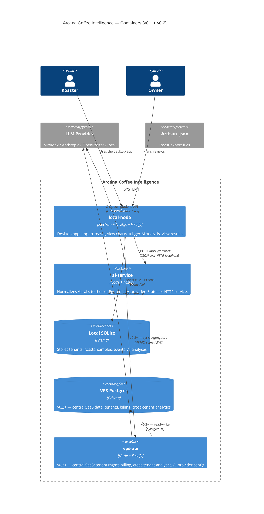

# C4 Level 2 — Containers

Zooms into the Arcana system and shows the runtime containers that make it up. v0.1 has 2 containers; the planned v0.2 system has 3.

## Container responsibilities

### `local-node` (v0.1 — built)
- **Electron wrapper** — Win 7+ installer, spawns the server as a child process
- **Next.js 15 UI** — `/`, `/import`, `/roasts/[id]` pages
- **Fastify server** — REST API on port 4000, talks to the local DB and the AI service
- **Storage** — SQLite (single file) for tenants, roasts, samples, events, AI results
- **No auth** in v0.1 — single-tenant demo mode. Auth comes in v0.2.

### `ai-service` (v0.1 — built)
- Stateless Fastify service on port 4001
- Reads `AI_PROVIDER` env var to select the adapter (minimax default)
- Exposes:
  - `GET  /health` — provider + model + uptime
  - `POST /analyze/roast` — main entry point
- Returns Zod-validated structured JSON
- Logs token usage to stdout (VPS `AiUsageRecord` integration in v0.2)

### `vps-api` (v0.2+ — NOT built)
- Multi-tenant SaaS backend
- Per-tenant API key management for LLM providers
- Billing + invoicing
- Cross-tenant analytics
- Sync endpoint that local nodes push aggregates to

### `cloudDb` (v0.2+ — NOT built)
- PostgreSQL on the central VPS
- Mirrors the local SQLite data for cloud queries
- Tenant-scoped via JWT

## Technology choices

| Layer | Choice | Why |
|---|---|---|
| Local DB | **SQLite** via Prisma | Zero-setup, single file, easy backup, perfect for one-roastery-per-PC. Swap to Postgres in v0.2 with a one-line schema change. |
| Server | **Fastify** | Faster startup, better TS DX, less boilerplate than Express |
| UI | **Next.js 15 + React 19 + Tailwind 3** | App Router + static export makes the same UI work for dev (HTTP) and prod (Electron file://) |
| AI | **MiniMax** + Zod-validated JSON | Cheap, fast, good at structured output. Anthropic fallback ready in v0.2. |
| Installer | **electron-builder 22 + NSIS** | Last combo that supports Win 7 SP1. NSIS is the most familiar installer UX. |
