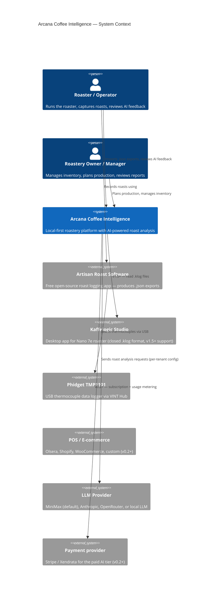

# C4 Level 1 — System Context

Shows how Arcana fits in the world around it: who uses it, what external systems it talks to.

## Notes

- **Local-first.** v0.1 runs entirely on the roastery PC. No data leaves the LAN except anonymized LLM requests when the operator runs AI analysis.
- **Open by default.** We use Artisan (free, open-source) as the primary roast capture tool, so operators don't have to learn a new app to start using Arcana.
- **Phidget is just a sensor.** We don't talk to the Phidget directly in v0.1 — Artisan already does that. v0.2 will add a direct capture path.
- **LLM provider is swappable.** MiniMax is the default. Anthropic, OpenRouter, and local LLM adapters exist; only MiniMax is wired in v0.1.
